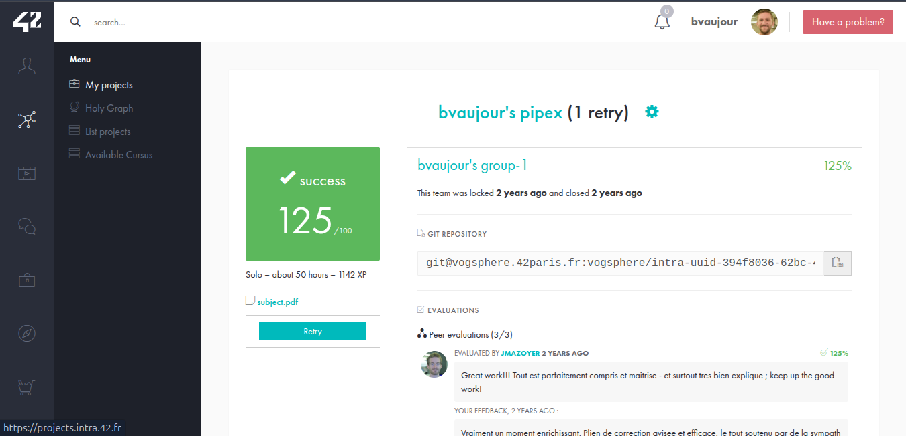

# Pipex
[Voir le sujet](./subject.pdf)

Projet de niveau 3 de l'école 42.

Reproduction du comportement de la commande shell `< infile cmd1 | cmd2 > outfile`, avec gestion des pipes et exécutions via `execve`.

